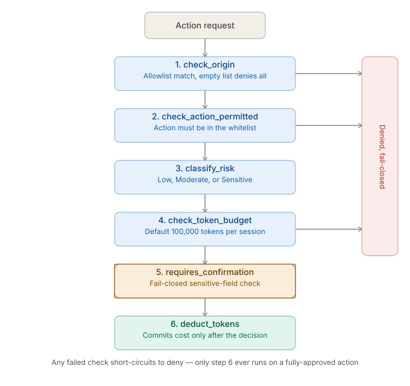
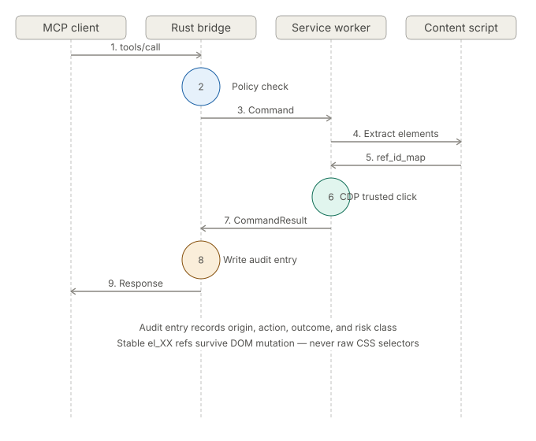

<div align="center">

# Momo

**Policy-compliant autonomous AI browser agent operating in local context with transparent interaction**

[](https://github.com/HoldTroop/Momo/actions)
[](LICENSE.md)
[](https://github.com/HoldTroop/Momo/releases)
[](https://www.google.com/chrome/)
[](https://developer.chrome.com/docs/extensions/mv3/)

</div>

---

## Overview

Momo is a fully autonomous AI browser extension that executes complex multi-step browser tasks using your authenticated sessions, residential IP, and local hardware. Built on Chrome Manifest V3 with a Rust backend, it operates entirely locally with transparent, policy-governed interactions.

Unlike cloud-based browser automation, Momo runs in your real Chrome profile with access to your cookies, sessions, certificates, and behavioral history. It combines Chrome DevTools Protocol (CDP) for trusted input simulation, accessibility tree extraction for robust element targeting, and a fail-closed policy engine for security.


For comprehensive documentation, guides, and tutorials, see the [docs/](docs/README.md) directory.
---

## Table of Contents
- [Quick Start](#quick-start)

- [Features](#features)
- [Architecture](#architecture)
- [Tech Stack](#tech-stack)
- [Getting Started](#getting-started)
  - [Prerequisites](#prerequisites)
  - [Installation](#installation)
  - [Configuration](#configuration)
- [Usage](#usage)
- [Project Structure](#project-structure)
- [Development](#development)
  - [Building](#building)
  - [Testing](#testing)
  - [Debugging](#debugging)
- [Troubleshooting](#troubleshooting)
- [Security](#security)
- [Roadmap](#roadmap)
- [Contributing](#contributing)
- [License](#license)
- [Acknowledgments](#acknowledgments)

---

## Quick Start

Get Momo running in 5 minutes.

**Prerequisites**: Node.js 20+, Rust 1.70+, Chrome 118+

**Steps**:

1. **Clone and install dependencies**
   \`\`\`bash
   git clone https://github.com/HoldTroop/Momo.git && cd Momo && npm install
   \`\`\`

2. **Build the extension and bridge**
   \`\`\`bash
   npm run build:all
   \`\`\`

3. **Load extension in Chrome**
   - Open \`chrome://extensions/\`, enable Developer mode, click Load unpacked, select the \`dist/\` folder

4. **Start the bridge**
   \`\`\`bash
   ./bridge/target/release/agent-bridge
   \`\`\`

5. **Try your first task**
   - Click the Momo extension icon to open the side panel
   - Enter a task: \`"Search for the latest TypeScript documentation on Google"\`

**Next steps**: See [Getting Started](#getting-started) for detailed configuration and usage options.

---

## Features

**Autonomous Execution**
- Natural language task description with multi-step planning and execution
- Self-recovery from errors, stale references, and navigation changes
- Crash-resistant operation with write-ahead logging and checkpoints in IndexedDB

**Local-First Architecture**
- Runs entirely in your browser with no cloud dependency for execution
- Uses your authenticated Chrome profile: cookies, sessions, certificates, HSTS
- Real TLS fingerprint (BoringSSL), HTTP/2 (nghttp2), and residential IP

**Policy-Governed Security**
- Origin allowlists with subdomain-bounded matching (fail-closed by default)
- Risk classification (Sensitive/Moderate/Low) with confirmation gates
- SQLite-backed audit log tracking every action and authorization decision
- Token budget enforcement preventing runaway execution

**Human-in-the-Loop Controls**
- Confirm/deny/takeover modals for sensitive actions (payments, authentication, destructive operations)
- Real-time side panel UI with streaming execution log and intervention controls
- Kill switch with immediate task abortion and rollback

**Robust Perception**
- Hybrid perception layer: Markdown extraction (Readability + Turndown) for comprehension, pruned accessibility tree for action
- Stable element references with automatic stale-reference recovery
- CDP-based accessibility tree extraction with JavaScript fallback

**MCP Integration (Phase 9)**
- Model Context Protocol support over stdio (NDJSON JSON-RPC 2.0)
- Dual-mode Rust bridge: internal orchestration (Mode A) or MCP client control (Mode B)
- Four MCP tools: `read_page_content`, `get_interactive_elements`, `execute_action`, `list_tabs`

---

## Architecture

```
┌─────────────────────────────────────────────────────────────────┐
│  Chrome Extension (Manifest V3, TypeScript)                     │
├─────────────────────────────────────────────────────────────────┤
│  Service Worker                   │  Side Panel (React)         │
│  - AgentOrchestrator              │  - Real-time streaming UI   │
│  - MessageRouter                  │  - Task intervention        │
│  - CDP adapter                    │  - Session management       │
│  - WebSocket client (to bridge)   │  - Confirmation modals      │
├─────────────────────────────────────────────────────────────────┤
│  Content Scripts (ISOLATED world)                               │
│  - Accessibility tree extraction (CDP + JS fallback)            │
│  - Perception layer (Markdown + interactive elements)           │
│  - DOM observation (MutationObserver)                           │
│  - Human input fallback (untrusted events)                      │
├─────────────────────────────────────────────────────────────────┤
│  Libraries                                                       │
│  - Tool registry (navigate, click, type, scroll, observe)       │
│  - Persistence layer (Dexie IndexedDB with WAL)                 │
│  - Redaction engine (passwords, tokens, PII, credit cards)      │
│  - Selector heuristics (isActionable, resolveTarget)            │
└─────────────────────────────────────────────────────────────────┘
                              ▲
                              │ WebSocket (ws://127.0.0.1:9090-9100)
                              ▼
┌─────────────────────────────────────────────────────────────────┐
│  Rust Bridge (agent-bridge, Tokio + Axum)                      │
├─────────────────────────────────────────────────────────────────┤
│  Mode A: Internal Orchestration  │  Mode B: MCP over stdio     │
│  - LLM gateway (Anthropic/Ollama)│  - JSON-RPC 2.0 (NDJSON)    │
│  - Policy engine                 │  - Tool dispatch to WS       │
│  - Audit log (SQLite)            │  - Command/CommandResult     │
├─────────────────────────────────────────────────────────────────┤
│  Core Services                                                   │
│  - WebSocket server (ConnectionManager)                         │
│  - Command channel (send_command with pending registry)         │
│  - Policy enforcement (origin, actions, budget, confirmation)   │
│  - Trusted input executor (CDP Input API)                       │
└─────────────────────────────────────────────────────────────────┘
```

### Five-Layer Architecture



**Trust Boundary**: The Rust bridge is the authoritative policy boundary. The extension never self-authorizes; all actions pass through `PolicyEngine::evaluate` before execution.



---

## Tech Stack

| Layer | Technology |
|-------|-----------|
| **Extension** | TypeScript, Chrome Manifest V3, React (Side Panel) |
| **Build** | Vite, Vitest, ESLint, TypeScript Compiler |
| **Backend** | Rust 2021, Tokio (async runtime), Axum (HTTP/WebSocket) |
| **Storage** | Dexie (IndexedDB), SQLite (audit log, policy config) |
| **Protocol** | Chrome DevTools Protocol (CDP), WebSocket, MCP (stdio) |
| **Perception** | Mozilla Readability, Turndown (HTML→Markdown), CDP Accessibility API |
| **LLM** | Anthropic Claude API, Ollama (local inference) |

---

## Getting Started

### Prerequisites

- **Node.js** 18 or higher
- **Rust** 1.70 or higher with Cargo
- **Chrome or Chromium** 118 or higher (Manifest V3, `chrome.debugger` support)
- **Operating System**: Linux, macOS, or Windows

### Installation

1. Clone the repository:

```bash
git clone https://github.com/HoldTroop/Momo.git
cd Momo
```

2. Install Node.js dependencies:

```bash
npm install
```

3. Build the Rust bridge:

```bash
npm run build:bridge
```

This compiles the native messaging host to `bridge/target/release/agent-bridge`.

4. Build the Chrome extension:

```bash
npm run build
```

This bundles the extension into the `dist/` directory.

5. Load the extension in Chrome:

   - Open `chrome://extensions/`
   - Enable **Developer mode** (toggle in the top-right corner)
   - Click **Load unpacked**
   - Select the `dist/` folder from this repository

The extension icon should appear in your toolbar.

### Configuration

#### Environment Variables

The bridge accepts configuration via environment variables:

```bash
# Optional: Anthropic API key for cloud LLM (Mode A only)
export ANTHROPIC_API_KEY="sk-ant-..."

# Optional: Ollama base URL for local inference (default: http://localhost:11434)
export OLLAMA_BASE_URL="http://localhost:11434"

# Optional: Command timeout in milliseconds (default: 30000)
export MOMO_COMMAND_TIMEOUT_MS=30000
```

#### Policy Configuration



The bridge creates a SQLite database at `~/.momo/policy.db` on first run. Policy configuration is managed through the bridge's `POLICY_SET_CONFIG` request or by editing the database directly.

Default policy (fail-closed):

```json
{
  "origin_allowlist": [],
  "permitted_actions": [],
  "confirmation_policy": "Sensitive",
  "token_budget_per_task": 100000
}
```

To allow specific origins:

```json
{
  "origin_allowlist": ["example.com", "*.google.com"],
  "permitted_actions": ["click", "type", "navigate", "scroll"],
  "confirmation_policy": "Moderate",
  "token_budget_per_task": 200000
}
```

---

## Usage

### Mode A vs Mode B



### Mode A: Internal Orchestration (Default)

Start the bridge in orchestration mode (WebSocket only, no MCP):

```bash
./bridge/target/release/agent-bridge
```

The extension connects automatically via WebSocket discovery (ports 9090-9100).

Open the extension's side panel (click the extension icon or use `Ctrl+Shift+Y`) and start a task:

```
Task: "Find the cheapest flight from SFO to NYC on Google Flights for next weekend"
```

The orchestrator plans, executes, and streams results to the side panel in real-time.

### Mode B: MCP over stdio



Run the bridge in MCP mode:

```bash
./bridge/target/release/agent-bridge --mcp
```

The bridge exposes four MCP tools over stdio (NDJSON JSON-RPC 2.0):

```json
{
  "jsonrpc": "2.0",
  "id": 1,
  "method": "tools/list",
  "params": {}
}
```

Response:

```json
{
  "jsonrpc": "2.0",
  "id": 1,
  "result": {
    "tools": [
      {
        "name": "read_page_content",
        "description": "Read the current page as token-efficient Markdown. Returns title, url, and markdown_content for summarization and Q&A. Read-only; no action is taken.",
        "inputSchema": {
          "type": "object",
          "properties": {
            "tab_id": { "type": "integer", "description": "Target tab id; omit for the active tab." }
          }
        }
      },
      {
        "name": "get_interactive_elements",
        "description": "Return a pruned accessibility tree of visible + interactive elements (role, label, state, bounds, stable ref el_XX). Use this to decide what to click; do NOT target raw CSS selectors.",
        "inputSchema": {
          "type": "object",
          "properties": {
            "tab_id": { "type": "integer", "description": "Target tab id; omit for the active tab." }
          }
        }
      },
      {
        "name": "execute_action",
        "description": "Execute one action against a stable element ref (el_XX) from get_interactive_elements: click, type, scroll, or navigate. ref is the only targeting key; raw CSS selectors are rejected.",
        "inputSchema": {
          "type": "object",
          "properties": {
            "action": { "type": "string", "enum": ["click", "type", "scroll", "navigate"] },
            "ref": { "type": "string", "description": "Stable el_XX id from get_interactive_elements" },
            "text": { "type": "string", "description": "Text to type (action=type only)" },
            "url": { "type": "string", "format": "uri", "description": "URL to navigate to (action=navigate only)" },
            "tab_id": { "type": "integer", "description": "Target tab id; omit for the active tab." }
          },
          "required": ["action"]
        }
      },
      {
        "name": "list_tabs",
        "description": "Enumerate the browser's tabs (tab_id, window_id, active, title, url) so page-scoped tools can target a specific tab.",
        "inputSchema": { "type": "object", "properties": {} }
      }
    ]
  }
}
```

Call a tool:

```json
{
  "jsonrpc": "2.0",
  "id": 2,
  "method": "tools/call",
  "params": {
    "name": "read_page_content",
    "arguments": {}
  }
}
```

Response (success):

```json
{
  "jsonrpc": "2.0",
  "id": 2,
  "result": {
    "content": [
      {
        "type": "text",
        "text": "{\"command\":\"read_page_content\",\"status\":\"ok\",\"title\":\"Example Domain\",\"url\":\"https://example.com\",\"markdown_content\":\"# Example Domain\\n\\nThis domain is for use in illustrative examples...\"}"
      }
    ],
    "isError": false
  }
}
```

Response (failure - e.g., stale reference):

```json
{
  "jsonrpc": "2.0",
  "id": 3,
  "result": {
    "content": [
      {
        "type": "text",
        "text": "{\"error\":\"stale_reference\",\"ref\":\"el_45\",\"hint\":\"re-fetch get_interactive_elements\"}"
      }
    ],
    "isError": true
  }
}
```

### Example: Claude Code Integration

Use Momo as an MCP server with Claude Code:

```bash
# In one terminal, start the bridge in MCP mode
./bridge/target/release/agent-bridge --mcp

# In another terminal, use Claude Code with the MCP server
claude --mcp-server momo ./bridge/target/release/agent-bridge --mcp
```

Claude Code can now control your browser through Momo's MCP tools.

---

## Project Structure

```
Momo/
├── src/                          # Chrome extension source (TypeScript)
│   ├── sw/                       # Service worker (orchestrator, message router, CDP)
│   │   ├── orchestrator.ts       # Core task orchestration and state machine
│   │   ├── message-router.ts     # Message dispatch and bridge command handler
│   │   ├── cdp-adapter.ts        # Chrome DevTools Protocol wrapper
│   │   ├── ws-client.ts          # WebSocket client with reconnect and outbox
│   │   ├── alarm-manager.ts      # Persistent alarms for task resumption
│   │   ├── bridge-port.ts        # Port discovery (9090-9100 scan)
│   │   ├── port-manager.ts       # Extension port lifecycle management
│   │   └── index.ts              # Service worker entry point
│   ├── content/                  # Content scripts (ISOLATED world)
│   │   ├── perception.ts         # Readability + Turndown + ref-id injection
│   │   ├── ax-extractor.ts       # CDP + JS accessibility tree extraction
│   │   ├── dom-observer.ts       # MutationObserver for page changes
│   │   └── human-input.ts        # Untrusted input fallback
│   ├── sidepanel/                # React side panel UI
│   │   └── index.tsx             # Streaming chat, task controls, session history
│   └── lib/                      # Shared libraries
│       ├── tool-registry.ts      # Tool definitions and executors
│       ├── persistence.ts        # Dexie IndexedDB with WAL
│       ├── redaction.ts          # Secret/PII redaction engine
│       ├── selector.ts           # isActionable, resolveTarget heuristics
│       ├── task-queue.ts         # Task queuing and scheduling
│       ├── permissions.ts        # Chrome permissions checks
│       └── dom-compressor.ts     # DOM snapshot compression
├── bridge/                       # Rust backend (Tokio + Axum)
│   └── src/
│       ├── main.rs               # Entry point, BridgeServer, dual-mode routing
│       ├── ws_server.rs          # WebSocket server and ConnectionManager
│       ├── mcp_stdio.rs          # MCP stdio transport (NDJSON JSON-RPC 2.0)
│       ├── mcp_tools.rs          # MCP tool schemas and dispatch
│       ├── policy.rs             # PolicyEngine (allowlist, audit, confirmation)
│       ├── llm.rs                # LlmGateway (Anthropic, Ollama)
│       └── types.rs              # Shared serde types (BridgeRequest/Response)
├── tools/                        # Development and testing utilities
│   └── mock-extension.mjs        # Mock WebSocket client for bridge testing
├── tests/                        # Integration tests
├── docs/                         # Architecture decision records (ADRs)
│   └── adr/
│       └── 0001-policy-gate.md
├── icons/                        # Extension icons
├── dist/                         # Build output (extension bundle)
├── manifest.json                 # Chrome extension manifest (Manifest V3)
├── vite.config.ts                # Vite build configuration
├── package.json                  # Node.js dependencies and scripts
├── tsconfig.json                 # TypeScript compiler configuration
├── vitest.config.ts              # Vitest test configuration
├── CONTRIBUTING.md               # Contribution guidelines
├── CHANGELOG.md                  # Release history
├── SECURITY.md                   # Security policy and reporting
└── PHASE9_MCP_PLAN.md            # Phase 9 (MCP integration) design document
```

---

## Development

### Building

```bash
# Build everything (extension + bridge)
npm run build:all

# Build extension only (Vite → dist/)
npm run build

# Build Rust bridge only (Cargo → target/release/agent-bridge)
npm run build:bridge

# Watch mode (extension auto-rebuild on file changes)
npm run dev
```

### Testing

**Unit Tests (Vitest)**

```bash
# Run all tests
npm test

# Watch mode
npm run test -- --watch
```

Test files are co-located with source:
- `src/lib/redaction.test.ts` (21 tests)
- `src/lib/dom-compressor.test.ts` (4 tests)
- `src/content/perception.test.ts` (7 tests)

**Rust Tests**

```bash
cd bridge
cargo test
```

**Type Checking**

```bash
npx tsc --noEmit
```

**Linting**

```bash
npm run lint
```

### Debugging

**Extension Debugging**

1. Open `chrome://extensions/`
2. Find "Autonomous AI Agent" and click **Inspect views: service worker**
3. Use the Chrome DevTools console to inspect logs

Service worker logs use prefixed namespaces:
- `[Orchestrator]` - Task execution and state transitions
- `[MessageRouter]` - Message dispatch and bridge commands
- `[WsClient]` - WebSocket connection and frame-level protocol
- `[CDP]` - Chrome DevTools Protocol interactions
- `[Perception]` - DOM/AXTree extraction and ref resolution

**Bridge Debugging**

The Rust bridge uses `tracing` with structured logging:

```bash
# Enable debug logs
RUST_LOG=debug ./bridge/target/release/agent-bridge

# Filter to specific modules
RUST_LOG=agent_bridge::mcp_tools=trace,agent_bridge::ws_server=debug ./bridge/target/release/agent-bridge
```

**Mock Extension Client**

Test the bridge's WebSocket and MCP layers without the full extension:

```bash
# Test read_page_content round-trip
node tools/mock-extension.mjs roundtrip

# Test get_interactive_elements
node tools/mock-extension.mjs interactive

# Test execute_action with stale_reference error
node tools/mock-extension.mjs stale

# Test command timeout
MOMO_COMMAND_TIMEOUT_MS=2000 node tools/mock-extension.mjs timeout
```

---

## Troubleshooting

### Extension not loading

**Symptoms**: Extension doesn't appear in toolbar, or shows as disabled in `chrome://extensions/`

**Solutions**:
- Verify Chrome version is 118 or higher: `chrome://version/`
- Ensure Developer mode is enabled in `chrome://extensions/` (toggle in top-right)
- Confirm build artifacts exist in `dist/` directory (run `npm run build` if missing)
- Check for manifest errors in the extension card (red error banner)
- Try removing and reloading the extension: click **Remove** → **Load unpacked** → select `dist/`
- Clear extension cache: disable extension, close all Chrome windows, re-enable

### Bridge connection failures

**Symptoms**: Extension shows "Disconnected" or "Bridge unavailable" in side panel

**Solutions**:
- Verify bridge is running: `ps aux | grep agent-bridge`
- Start the bridge if not running: `./bridge/target/release/agent-bridge`
- Check WebSocket port availability (9090-9100): `lsof -i :9090-9100` or `netstat -an | grep 909`
- Test manual connection: `wscat -c ws://127.0.0.1:9090` (install via `npm i -g wscat`)
- Check firewall/security software: ensure localhost WebSocket connections are allowed
- Look for port conflicts: if another service is using ports 9090-9100, stop it or configure bridge to use different ports
- Review bridge logs: `RUST_LOG=debug ./bridge/target/release/agent-bridge` and check for connection errors
- Restart both bridge and extension: close Chrome completely, restart bridge, reopen Chrome

**Port discovery troubleshooting**:
```bash
# Check if bridge is listening on expected ports
netstat -tlnp | grep agent-bridge

# Test connectivity manually
curl -i -N -H "Connection: Upgrade" -H "Upgrade: websocket" \
  -H "Sec-WebSocket-Version: 13" -H "Sec-WebSocket-Key: test" \
  http://localhost:9090
```

### Actions denied by policy

**Symptoms**: Tasks fail with "Action denied by policy" or "Origin not in allowlist"

**Solutions**:
- Check current policy configuration at `~/.momo/policy.db`
- Add target origins to allowlist (see [Configuration](#configuration))
- Verify allowed actions include necessary operations: `click`, `type`, `navigate`, `scroll`
- Review audit logs for denial reasons:
  ```bash
  sqlite3 ~/.momo/policy.db "SELECT * FROM audit_log ORDER BY timestamp DESC LIMIT 10;"
  ```
- Ensure `confirmation_policy` matches your security requirements (`Low`, `Moderate`, or `Sensitive`)
- Check token budget hasn't been exceeded: `token_budget_per_task` in policy configuration
- For subdomain matching, use wildcard syntax: `*.example.com` (not `example.com` alone)
- Test with permissive policy first, then tighten:
  ```json
  {
    "origin_allowlist": ["*"],
    "permitted_actions": ["click", "type", "navigate", "scroll"],
    "confirmation_policy": "Low",
    "token_budget_per_task": 500000
  }
  ```

### Stale element references

**Symptoms**: Actions fail with "stale_reference" error or "Element no longer exists"

**Solutions**:
- Momo automatically retries with fresh element resolution (see src/lib/tool-registry.ts:152)
- Stale references occur when the DOM changes between element discovery and action execution
- If retries fail repeatedly, the page may have aggressive dynamic content:
  - Increase `MOMO_COMMAND_TIMEOUT_MS` to allow more time for DOM stabilization
  - Wait for specific page state before actions (e.g., "wait until page stops loading")
  - Use MCP mode and manually call `get_interactive_elements` before each action
- Check for JavaScript frameworks that continuously mutate DOM (React, Vue, Angular)
- Review logs for `[Perception]` warnings about rapid DOM changes
- For single-page applications (SPAs), ensure navigation is complete before executing actions

**Manual recovery in MCP mode**:
```json
// 1. Get fresh elements
{"jsonrpc":"2.0","id":1,"method":"tools/call","params":{"name":"get_interactive_elements"}}

// 2. Use new ref from response
{"jsonrpc":"2.0","id":2,"method":"tools/call","params":{"name":"execute_action","arguments":{"action":"click","ref":"el_47"}}}
```

### API key/LLM issues

**Symptoms**: Bridge starts but tasks fail with "LLM error" or "Authentication failed"

**Solutions**:
- Verify `.env` file exists in bridge directory or environment variables are set
- Check Anthropic API key is valid: `echo $ANTHROPIC_API_KEY` (should start with `sk-ant-`)
- Test API key manually:
  ```bash
  curl https://api.anthropic.com/v1/messages \
    -H "x-api-key: $ANTHROPIC_API_KEY" \
    -H "anthropic-version: 2023-06-01" \
    -H "content-type: application/json" \
    -d '{"model":"claude-3-5-sonnet-20241022","max_tokens":1024,"messages":[{"role":"user","content":"Hello"}]}'
  ```
- For Ollama (local inference):
  - Verify Ollama is running: `curl http://localhost:11434/api/tags`
  - Check model is pulled: `ollama list`
  - Pull required model if missing: `ollama pull llama3.1`
  - Set `OLLAMA_BASE_URL` if using non-default port
- Check rate limits: Anthropic API has tiered rate limits based on usage
- Review bridge logs for detailed error messages: `RUST_LOG=agent_bridge::llm=debug`
- Ensure network connectivity: test with `curl https://api.anthropic.com`

### Build failures

**Symptoms**: `npm run build` or `npm run build:bridge` fails with compilation errors

**Solutions**:

**Node.js/TypeScript build issues**:
- Verify Node.js version: `node --version` (requires 18+)
- Clear dependency cache and reinstall: `rm -rf node_modules package-lock.json && npm install`
- Check for TypeScript errors: `npx tsc --noEmit`
- Verify Vite config: ensure `vite.config.ts` has correct paths to `manifest.json`
- Clear Vite cache: `rm -rf node_modules/.vite`
- Update dependencies: `npm update` (check for breaking changes in `CHANGELOG.md`)

**Rust bridge build issues**:
- Verify Rust version: `rustc --version` (requires 1.70+)
- Update Rust toolchain: `rustup update stable`
- Clean and rebuild: `cd bridge && cargo clean && cargo build --release`
- Check for missing system libraries:
  - Linux: `sudo apt-get install pkg-config libssl-dev libsqlite3-dev`
  - macOS: `brew install openssl sqlite`
  - Windows: install Visual Studio Build Tools with C++ development workload
- Platform-specific linking errors:
  - macOS ARM64: ensure XCode command-line tools are installed (`xcode-select --install`)
  - Linux: verify `gcc` and `g++` are available
  - Windows: use `x64 Native Tools Command Prompt for VS 2022`
- Check Cargo.toml for platform-specific dependencies

**Dependency conflicts**:
```bash
# Check for outdated packages
npm outdated

# Audit for vulnerabilities
npm audit

# Fix automatically when possible
npm audit fix
```

For persistent build issues, see [CONTRIBUTING.md](CONTRIBUTING.md) or [open an issue](https://github.com/HoldTroop/Momo/issues).

---

## Security

Momo is designed with security as a first-class concern. All input is treated as untrusted until explicitly authorized by the policy engine.

### Security Model

- **Fail-closed policy**: Empty allowlist denies all actions
- **Least privilege**: Chrome debugger permission is optional and requested on first use
- **Redaction at source**: Passwords, tokens, PII, and credit card numbers are redacted before entering LLM context, persistence, or logs
- **Audit trail**: SQLite-backed immutable audit log tracks every authorization decision and action outcome
- **Human-in-the-loop**: High-risk actions require explicit confirmation before execution
- **No anti-bot evasion**: Transparent automation using Chrome's official APIs (`chrome.debugger`, CDP Input)

### Reporting Vulnerabilities

Please report security issues responsibly through our [security advisory form](https://github.com/HoldTroop/Momo/security/advisories/new).

Do not open public issues for security vulnerabilities.

---

## Roadmap

- [ ] Multi-agent coordination (parallel sub-tasks with handoff)
- [ ] Visual regression testing (screenshot diffing for UI verification)
- [ ] Extended MCP tool surface (DOM mutation, network interception, storage access)
- [ ] Cloud browser fallback (headless Chrome in AWS Lambda for tasks requiring fresh fingerprints)
- [ ] Advanced recovery strategies (automatic CAPTCHA detection and escalation)
- [ ] Plugin system for custom tool definitions

---

## Contributing

Contributions are welcome. Please read [CONTRIBUTING.md](CONTRIBUTING.md) and our [Code of Conduct](CODE_OF_CONDUCT.md) for detailed guidelines on commit conventions, pull requests, and code standards.

For common questions and troubleshooting, see our [FAQ](docs/FAQ.md).

Key points:

- Use [Conventional Commits](https://www.conventionalcommits.org/) for commit messages (`feat:`, `fix:`, `chore:`)
- Add tests for new features (Vitest for TypeScript, Cargo test for Rust)
- Update `CHANGELOG.md` under `[Unreleased]` for user-facing changes
- Run `npm run lint` and `npx tsc --noEmit` before submitting a PR

---

## Testing

Run the full test suite:

```bash
# TypeScript unit tests (Vitest)
npm test

# Rust unit and integration tests
cd bridge && cargo test

# Type checking
npx tsc --noEmit

# Linting
npm run lint
```

Current test coverage:
- TypeScript: 32 tests across redaction, DOM compression, and perception layers
- Rust: 27 tests covering MCP tools, WebSocket protocol, and policy engine

---

## License

This project is licensed under the [PolyForm Noncommercial License 1.0.0](LICENSE.md). Any noncommercial use is permitted; commercial use requires a separate license from the author.

---

## Acknowledgments

Built with:

- [Chrome DevTools Protocol](https://chromedevtools.github.io/devtools-protocol/)
- [Mozilla Readability](https://github.com/mozilla/readability)
- [Turndown](https://github.com/mixmark-io/turndown)
- [Tokio](https://tokio.rs/)
- [Axum](https://github.com/tokio-rs/axum)
- [Dexie.js](https://dexie.org/)
- [Vite](https://vitejs.dev/)
- [React](https://react.dev/)

Inspired by browser automation research and the Model Context Protocol specification.

---

<div align="center">

Made with focus by the Momo team

[Report Bug](https://github.com/HoldTroop/Momo/issues) · [Request Feature](https://github.com/HoldTroop/Momo/issues) · [Discussions](https://github.com/HoldTroop/Momo/discussions)

</div>
