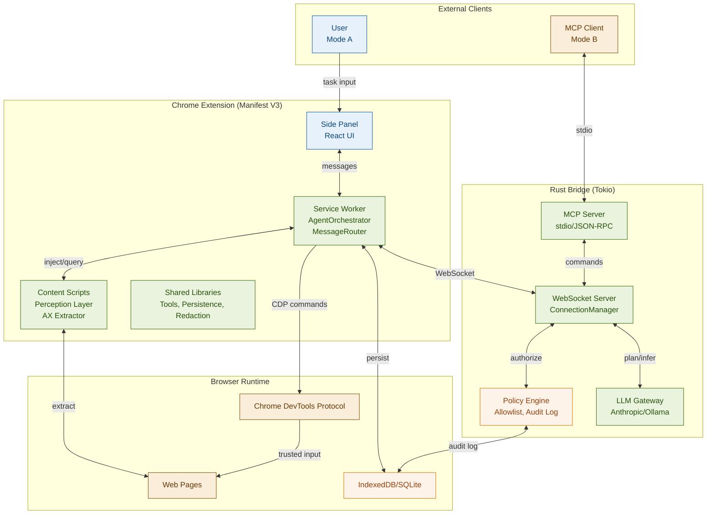
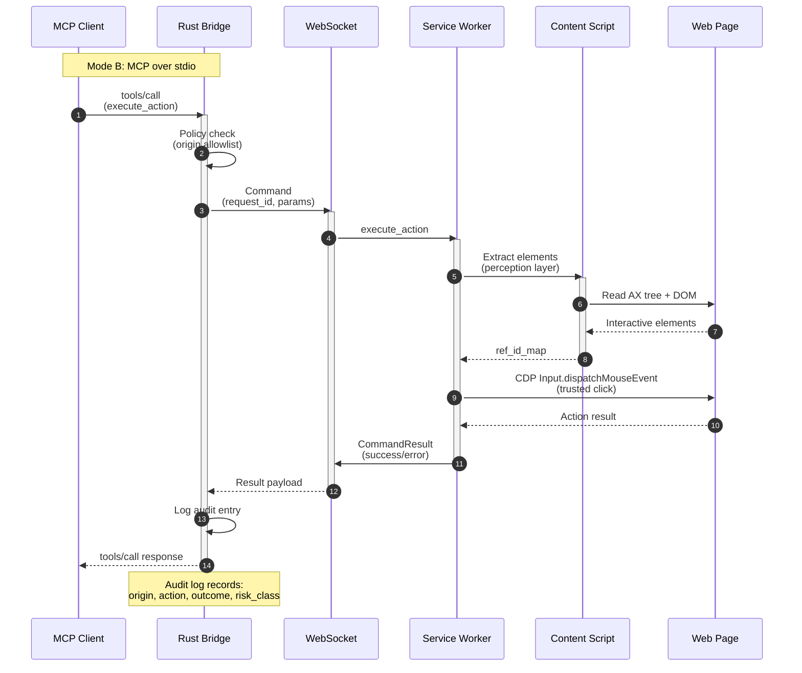
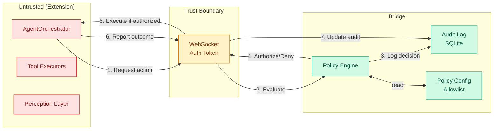

<div align="center">

# Momo Architecture

**Comprehensive architectural documentation for the autonomous AI browser agent**

[](https://github.com/HoldTroop/Momo/tree/main/docs)
[](architecture/index.html)
[](https://mermaid.js.org/)

</div>

---

## Overview

This document provides comprehensive architectural diagrams and explanations for the Momo autonomous AI browser agent. The architecture is designed around a **fail-closed policy engine** that enforces security boundaries between untrusted and trusted components.

**Architecture Highlights:**
- **Manifest V3** Chrome extension with TypeScript
- **Rust bridge** for policy enforcement and LLM gateway
- **WebSocket communication** between extension and bridge
- **MCP protocol support** for external client control
- **Fail-closed security model** with immutable audit logging

---

## Interactive Visualizations

For detailed, interactive architecture diagrams with tooltips, hover explanations, and filterable views:

**[View Interactive Architecture Visualizations →](architecture/index.html)**

### Available Diagrams

| Diagram | Description |
|---------|-------------|
| **Overall Architecture** | Complete system topology with 5 layers and 12 components |
| **Communication Layers** | Messaging patterns: chrome.runtime, WebSocket, CDP, MCP |
| **WebSocket Patterns** | RPC, pub/sub, and command-channel flows |
| **Tool Execution Flow** | Security-gated execution pipeline with 9 steps |
| **Perception System** | How Momo "sees" web pages: AX tree, redaction, stable refs |
| **Security Architecture** | Trust boundaries and fail-closed authorization model |
| **Operating Modes** | Mode A (autonomous orchestration) vs Mode B (MCP client control) |

---

## Component Architecture

Shows the major components and how they connect across the Chrome Extension, Rust Bridge, and Browser Runtime layers.

**Key Question:** *What are the pieces and how do they talk to each other?*



### Key Insights

- **Dual Operating Modes**: Momo operates in two modes:
  - **Mode A (Internal Orchestration)**: Bridge manages task planning, LLM inference, and execution autonomously
  - **Mode B (MCP Client Control)**: External MCP client controls the browser through four MCP tools

- **Service Worker Hub**: The Service Worker is the orchestration center, coordinating between UI, content scripts, CDP, and the bridge

- **Rust Bridge Responsibilities**: Provides policy enforcement, LLM inference, and MCP protocol support

- **WebSocket Communication**: All components use WebSocket for extension↔bridge communication with authentication

---

## MCP Tool Flow

Shows the complete request/response cycle when an MCP client executes a tool (e.g., `execute_action`).

**Key Question:** *What happens during a typical MCP tool call?*



### Key Insights

- **Command-Channel Pattern**: All MCP tools use a request-response pattern where the bridge issues a Command with request_id and the extension replies with CommandResult

- **Policy-First Approach**: Policy checks happen before the extension receives the command, enforcing fail-closed security

- **Dual Audit Logging**: The audit log records both the authorization decision AND the execution outcome for complete accountability

- **Stable Element References**: Content scripts extract stable element references (el_XX) to ensure actions target the correct elements even after DOM mutations

- **Trusted Input Execution**: Browser actions use CDP's Input API for trusted event dispatch, not synthetic JavaScript events

---

## Policy Boundary

Shows the trust model and how the policy engine enforces security constraints.

**Key Question:** *How does the fail-closed security model work?*



### Key Insights

- **Never Self-Authorize**: The extension (untrusted zone) never self-authorizes actions—all authorization flows through the bridge

- **Comprehensive Evaluation**: The policy engine checks:
  - Origin allowlists (fail-closed subdomain matching)
  - Action permissions (click, type, navigate, scroll)
  - Token budgets (resource limits)
  - Risk classifications (Sensitive/Moderate/Low)

- **Immutable Audit Trail**: Every authorization decision is recorded to an immutable SQLite audit log

- **Outcome Verification**: The extension reports back the real execution outcome (success/failure) so the audit log reflects actual results, not just intentions

- **Fail-Closed Design**: If the policy engine is unavailable or encounters an error, all actions are denied by default

---

## System Layers

The Momo architecture consists of five distinct layers:

### 1. User Interface Layer
- **Side Panel (React)**: Real-time streaming UI, task controls, session management
- **Intervention Modals**: Confirm/deny/takeover for sensitive actions

### 2. Extension Layer
- **Service Worker**: Orchestrator, message router, alarm manager, CDP adapter
- **Content Scripts**: Perception layer, AX extractor, DOM observer, human input fallback
- **Libraries**: Tool registry, persistence, redaction, task queue

### 3. Communication Layer
- **chrome.runtime**: Extension-internal messaging
- **WebSocket**: Extension↔bridge communication with authentication
- **CDP**: Chrome DevTools Protocol for trusted input
- **MCP**: Model Context Protocol over stdio

### 4. Bridge Layer
- **WebSocket Server**: Connection manager, command dispatcher
- **Policy Engine**: Authorization, allowlists, risk classification
- **LLM Gateway**: Multi-provider inference (Anthropic/Ollama)
- **MCP Server**: JSON-RPC 2.0 over stdio

### 5. Storage Layer
- **IndexedDB**: Extension state with WAL and checkpoints
- **SQLite**: Policy configuration and immutable audit log

---

## Data Flow Patterns

### Read-Only Operations (Low Risk)

1. User requests page content
2. Extension extracts Markdown via Readability + Turndown
3. Result returned directly (no policy gate)

### Write Operations (Policy-Gated)

1. User/client requests action (click, type, navigate)
2. Request sent to bridge via WebSocket
3. Policy engine evaluates against allowlist and permissions
4. Authorization decision logged to audit trail
5. If authorized, command dispatched to extension
6. Extension executes via CDP Input API
7. Execution outcome reported back to bridge
8. Audit log updated with actual result

### Human-in-the-Loop

1. Policy engine classifies action as Sensitive
2. Confirmation modal presented to user
3. User approves/denies/takes over
4. Decision logged and execution proceeds or aborts

---

## Security Architecture

### Trust Zones

| Zone | Components | Trust Level |
|------|------------|-------------|
| **Untrusted** | Extension (all components) | No self-authorization |
| **Trust Boundary** | WebSocket with auth token | Authenticated channel |
| **Trusted** | Rust bridge (policy, audit, LLM) | Authoritative |

### Security Principles

1. **Fail-Closed by Default**: Empty allowlist denies all actions
2. **Least Privilege**: Chrome debugger permission is optional, requested on first use
3. **Redaction at Source**: Passwords, tokens, PII redacted before LLM/persistence/logs
4. **Immutable Audit Trail**: SQLite log tracks every decision and outcome
5. **No Anti-Bot Evasion**: Transparent automation using official Chrome APIs

---

## Operating Modes

### Mode A: Internal Orchestration

```
User → Extension UI → Service Worker → Rust Bridge (LLM + Policy) → Browser
```

- Bridge manages task planning and LLM inference
- Extension executes authorized actions
- Fully autonomous operation
- Start with: `./bridge/target/release/agent-bridge`

### Mode B: MCP Client Control

```
MCP Client → Rust Bridge (MCP Server) → WebSocket → Extension → Browser
```

- External client controls browser through 4 MCP tools:
  - `read_page_content`: Extract Markdown from current page
  - `get_interactive_elements`: Get pruned AX tree with stable refs
  - `execute_action`: Click, type, scroll, or navigate
  - `list_tabs`: Enumerate browser tabs
- Bridge enforces policy for all tool calls
- Start with: `./bridge/target/release/agent-bridge --mcp`

---

## What's Not Shown

To keep these diagrams lean and focused, the following implementation details are intentionally omitted:

**Tool Implementations**
- Individual tool executors (navigate, click, type, scroll)
- Selector heuristics and element resolution
- Stale reference recovery mechanisms

**State Management**
- Task queue with priority and retry policies
- Checkpoints and write-ahead logging (WAL)
- Crash recovery and resume logic

**Human Interaction**
- Confirmation modal flow and UI
- Kill switch implementation
- Session management and history

**Data Handling**
- Redaction engine patterns and rules
- DOM compression algorithms
- Perception layer token optimization

**Lifecycle Management**
- Alarm manager for persistent scheduling
- Port manager for extension messaging
- Watchdog for health monitoring

These details are important for implementation but don't define architectural boundaries.

---

## Editing These Diagrams

All diagram source files are in `docs/diagrams/*.mmd` (Mermaid format) and can be edited directly or pasted into [mermaid.live](https://mermaid.live) for interactive preview and tweaking.

### Re-render after edits:

```bash
# Install Mermaid CLI
npm install -g @mermaid-js/mermaid-cli

# Render individual diagram
npx mmdc -i docs/diagrams/component-architecture.mmd -o docs/diagrams/component-architecture.svg

# Render all diagrams
for file in docs/diagrams/*.mmd; do
  npx mmdc -i "$file" -o "${file%.mmd}.svg"
done
```

### Diagram Guidelines

- Keep diagrams focused on one architectural aspect
- Use consistent color coding across all diagrams
- Include "Key Insights" section after each diagram
- Answer a specific question with each diagram
- Maintain alignment with interactive HTML visualizations

---

## Additional Resources

- **[Interactive Visualizations](architecture/index.html)** - Detailed diagrams with tooltips and filtering
- **[ADR-0001: Policy Gate](adr/0001-policy-gate.md)** - Design decision for policy boundary
- **[Security Audit Report](audits/SECURITY_AUDIT_REPORT.md)** - Third-party security assessment
- **[Technical Audit](audits/TECHNICAL_AUDIT.md)** - Implementation analysis
- **[FAQ](FAQ.md)** - Frequently asked questions about architecture

---

<div align="center">

**Questions about the architecture?**

[Open a Discussion](https://github.com/HoldTroop/Momo/discussions) · [Report an Issue](https://github.com/HoldTroop/Momo/issues) · [View Source](https://github.com/HoldTroop/Momo)

</div>
