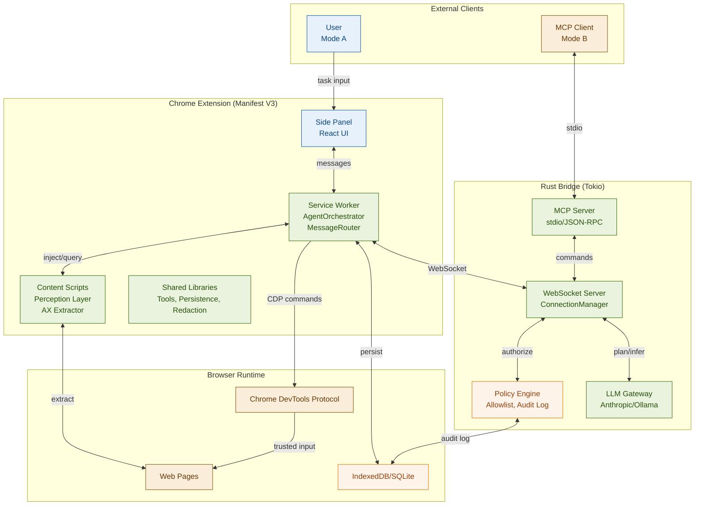
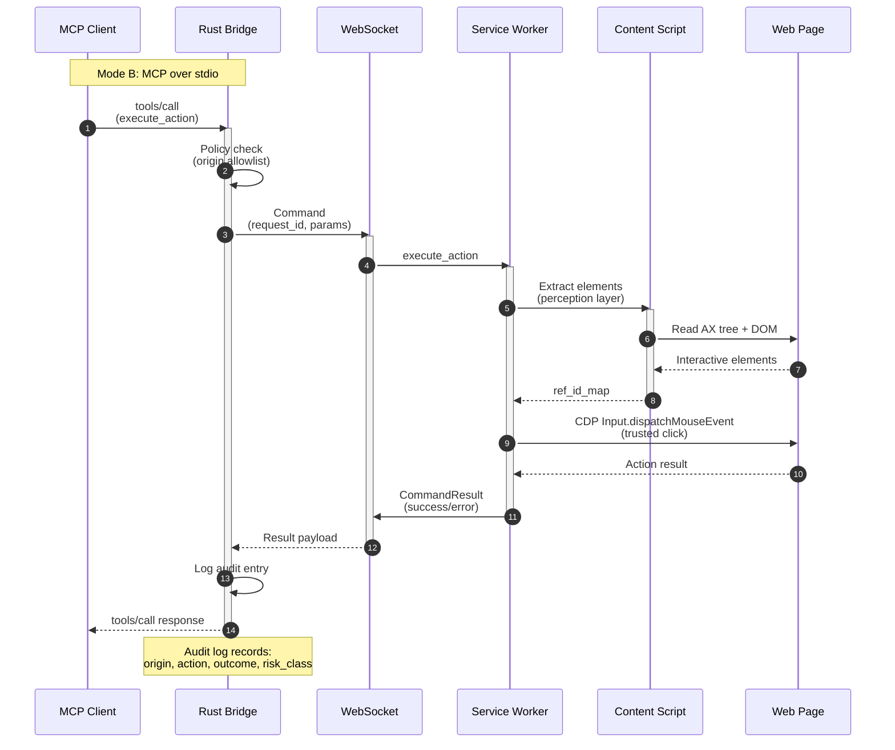
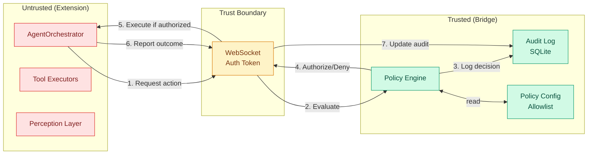

# Momo Architecture

This document provides architectural diagrams for the Momo autonomous AI browser agent.

## Interactive Visualizations

For detailed, interactive architecture diagrams with tooltips and explanations:

**[📊 View Interactive Architecture Visualizations →](architecture/index.html)**

The interactive diagrams include:
- **Overall Architecture** - Complete system topology (5 layers, 12 components)
- **Communication Layers** - Messaging patterns (chrome.runtime, WebSocket, CDP, MCP)
- **WebSocket Patterns** - RPC, pub/sub, and command-channel flows
- **Tool Execution Flow** - Security-gated execution pipeline (9 steps)
- **Perception System** - How Momo "sees" web pages (AX tree, redaction, stable refs)
- **Security Architecture** - Trust boundaries and fail-closed model
- **Operating Modes** - Mode A (autonomous) vs Mode B (MCP client control)

---

## Component Architecture

Shows the major components and how they connect across the Chrome Extension, Rust Bridge, and Browser Runtime layers. This diagram answers "What are the pieces and how do they talk to each other?"



**Key insights**:
- Momo operates in two modes: Mode A (internal orchestration) and Mode B (MCP client control)
- The Service Worker is the orchestration hub, coordinating between UI, content scripts, CDP, and the bridge
- The Rust bridge provides policy enforcement, LLM inference, and MCP protocol support
- All components use WebSocket for extension↔bridge communication

## MCP Tool Flow

Shows the complete request/response cycle when an MCP client executes a tool (e.g., `execute_action`). This diagram answers "What happens during a typical MCP tool call?"



**Key insights**:
- All MCP tools use the command-channel pattern: bridge issues a Command with request_id, extension replies with CommandResult
- Policy checks happen before the extension receives the command
- The audit log records both the authorization decision AND the execution outcome
- Content scripts extract stable element references (el_XX) to ensure actions target the correct elements even after DOM mutations

## Policy Boundary

Shows the trust model and how the policy engine enforces security constraints. This diagram answers "How does the fail-closed security model work?"



**Key insights**:
- The extension (untrusted zone) never self-authorizes actions
- All actions flow through the bridge's policy engine for evaluation
- The policy engine checks origin allowlists, action permissions, token budgets, and risk classifications
- The audit log is immutable and records every authorization decision
- The extension reports back the real execution outcome (success/failure) so the audit log can be corrected

## What's Not Shown

To keep these diagrams lean and focused, the following details are intentionally omitted:
- Individual tool implementations (navigate, click, type, scroll)
- Specific library dependencies (Dexie, Readability, Turndown)
- State management internals (checkpoints, WAL, task queue)
- Human intervention modals and confirmation flows
- Redaction engine and sensitive data handling
- Alarm manager, port manager, and other lifecycle utilities

These implementation details are important but don't define architectural boundaries.

## Editing These Diagrams

All diagram source files are in `docs/diagrams/*.mmd` and can be edited directly or pasted into [mermaid.live](https://mermaid.live) for interactive preview and tweaking.

To re-render after edits:
```bash
npx mmdc -i docs/diagrams/component-architecture.mmd -o docs/diagrams/component-architecture.svg
```
