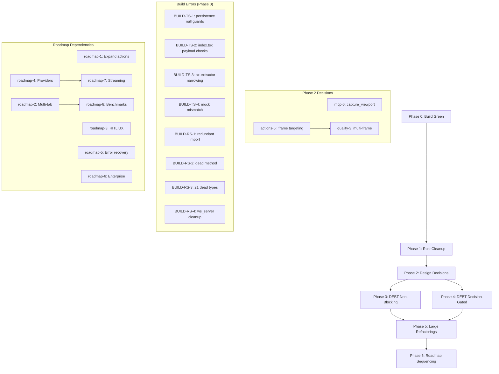

# Mega Fix Plan — Momo Agent

**Generated**: 2026-08-23  
**Branch**: `fix/audit-pass-2026-08-23`  
**Status**: 🔴 RED (68 TS errors, 41 clippy errors)  
**Goal**: GREEN — All type checks pass, all tests pass, all backlog items resolved, roadmap sequenced

---

## Executive Summary

**Current Health**: 🔴 **RED** — Build is broken. TypeScript fails with 68 errors across 4 files; Rust clippy fails with 41 errors (dead code + lints). Test suite passes (68/68 tests green).

**What "Done" Means**: 
1. Zero typecheck errors, zero clippy errors
2. All 18 remaining backlog items (mcp-3/4/6/7, actions-2/9/10/11, disc-2/4/6, quality-1/2/3/4/6/8/9/11/12) either implemented or explicitly decided-against with rationale
3. All 12 design stubs resolved (decisions made + queued for implementation or closed)
4. Roadmap items documented with clear sequencing and dependency chains
5. No regression — tests stay green throughout

**How We Got Here**: Fix Round 3 replaced `any` types in 10 files, added keyboard shortcuts, fixed darwin codesigning, unified ref schemes to `el_N`, and wrote 12 design stubs. The any-type replacement introduced null-safety violations in persistence.ts and undefined-payload issues in index.tsx. The LLM layer removal in commit 22ec205 left 21 unused types in bridge/src/types.rs.

---

## Full Issue Inventory

### BUILD (69 items blocking green)

| ID | Category | File(s) | Root Cause | Effort |
|---|---|---|---|---|
| **BUILD-TS-1** | BUILD | src/lib/persistence.ts | IndexedDB API returns `T \| null` but code assumes `T \| undefined` (31 errors) | S |
| **BUILD-TS-2** | BUILD | src/sidepanel/index.tsx | `msg.payload` is `optional` but no existence check before access (35 errors) | S |
| **BUILD-TS-3** | BUILD | src/content/ax-extractor.ts | Type narrowing failure: `unknown` not narrowed to `string` | S |
| **BUILD-TS-4** | BUILD | src/sw/orchestrator.test.ts | MockPersistenceManager missing 25 methods from real interface | M |
| **BUILD-RS-1** | BUILD | bridge/src/main.rs | Redundant import: `use dirs;` | S |
| **BUILD-RS-2** | BUILD | bridge/src/policy.rs | Dead method `get_token_usage` (unused after LLM removal) | S |
| **BUILD-RS-3** | BUILD | bridge/src/types.rs | 21 dead structs/enums from LLM layer removal | M |
| **BUILD-RS-4** | BUILD | bridge/src/ws_server.rs | 2 dead methods + 1 unused field + useless conversion | S |

---

### DEBT (18 backlog items not started)

| ID | Category | Title | Files | Effort |
|---|---|---|---|---|
| **mcp-3** | DEBT | `bridge_port` file race between Mode A/B | bridge/src/main.rs, bridge/src/ws_server.rs | M |
| **mcp-4** | DEBT | Command cancellation doesn't abort in-flight CDP | bridge/src/ws_server.rs, bridge/src/mcp_stdio.rs | M |
| **mcp-6** | DEBT | Missing `capture_viewport` (screenshot+VLM) tool | src/lib/tools/, src/lib/tool-registry.ts, bridge/src/mcp_tools.rs | L |
| **mcp-7** | DEBT | No MCP SDK reference tests | bridge/tests/, tests/ | M |
| **actions-2** | DEBT | No drag-and-drop simulation | src/lib/tools/ | M |
| **actions-9** | DEBT | No context-menu (right-click) simulation | src/lib/tools/ | S |
| **actions-10** | DEBT | No standalone hover tool | src/lib/tools/ | S |
| **actions-11** | DEBT | No double-click/long-press gestures | src/lib/tools/ | S |
| **disc-2** | DEBT | ADR-0001 vs implementation mismatch on deduct_tokens | docs/adr/0001-policy-gate.md, bridge/src/policy.rs | S |
| **quality-1** | DEBT | Task queue underutilized | src/lib/task-queue.ts, src/sw/orchestrator.ts | M |
| **quality-2** | DEBT | WAL replay not implemented | src/lib/task-queue.ts | M |
| **quality-4** | DEBT | orchestrator.ts has zero tests (1,312 lines) | src/sw/orchestrator.ts, tests/ | L |
| **quality-6** | DEBT | tool-registry.ts is 1,689-line god file | src/lib/tool-registry.ts | L |
| **quality-8** | DEBT | No Rust CI (cargo test/clippy missing) | .github/workflows/ | S |
| **quality-9** | DEBT | No Dependabot config | .github/dependabot.yml | S |
| **quality-11** | DEBT | Committed `.kilo/` worktree artifact | .kilo/ | S |
| **quality-12** | DEBT | `.env*` not in `.gitignore` | .gitignore | S |
| **quality-3** | DEBT | No multi-frame coordination | src/lib/tools/, src/sw/orchestrator.ts | M |

### DECISION (12 design stubs requiring architectural decisions)

| ID | Category | Title | Decision Needed | Blocks |
|---|---|---|---|---|
| **disc-4** | DECISION | Risk thresholds persistence without enforcement | How to implement threshold-based risk scoring? | None |
| **disc-6** | DECISION | Data retention policy not enforced | When does a session end for retention? | None |
| **mcp-6** | DECISION | Missing capture_viewport tool | VLM provider, rate limits, PII handling? | None |
| **actions-1** | DECISION | No file upload tool | How to handle file selection dialog? | None |
| **actions-4** | DECISION | No switch_to_tab/activate_tab | Chrome API permissions needed? | None |
| **actions-5** | DECISION | No iframe targeting | How to address cross-origin restrictions? | quality-3 |
| **actions-6** | DECISION | No visual verification (screenshot/OCR) | In-band or external OCR service? | None |
| **actions-7** | DECISION | No network interception | Chrome DevTools Protocol or webRequest API? | None |
| **actions-8** | DECISION | No shadow-DOM penetration | Pierce strategy vs querySelectorAll alternatives? | None |
| **quality-1** | DECISION | Task queue underutilized | Refactor to active scheduler or delete? | None |
| **quality-2** | DECISION | WAL replay not implemented | Implement or remove WAL feature? | None |
| **quality-3** | DECISION | No multi-frame coordination | iframe vs top-level frame architecture? | actions-5 |

### ROADMAP (8 longer-term enhancements)

| ID | Title | Description | Effort |
|---|---|---|---|
| **roadmap-1** | Expand action set | File ops, form handling, drag-drop | XL |
| **roadmap-2** | Multi-tab coordination | Window management, cross-tab state | L |
| **roadmap-3** | Rich HITL confirmation UX | Visual preview, diff highlighting | M |
| **roadmap-4** | OpenAI + Gemini providers | Multi-LLM support (Anthropic/Ollama only) | L |
| **roadmap-5** | Advanced error recovery | Context preservation across failures | M |
| **roadmap-6** | Enterprise compliance pack | SSO, RBAC, compliance reports | XL |
| **roadmap-7** | Token optimization + streaming | Streaming API support | M |
| **roadmap-8** | Benchmark suite | WebArena, Mind2Web, GAIA | M |

### REGRESSION (Issues introduced by Fix Round 3)

| ID | Category | Caused By | Fix |
|---|---|---|---|
| **BUILD-TS-1** | REGRESSION | any → unknown replacement | Add null guards |
| **BUILD-TS-2** | REGRESSION | any → unknown replacement | Add payload existence checks |
| **BUILD-RS-3** | REGRESSION | LLM layer removal (22ec205) | Delete unused types |

---

## Detailed Issue Breakdown

### BUILD-TS-1: persistence.ts null-safety violations (31 errors)

**Current State**: IndexedDB methods like `get()`, `put()`, `delete()` return `T | null`, but code was changed from `any` to `unknown` without adding null guards.

**Root Cause**: Fix Round 3 replaced `any` with `unknown` but didn't account for IndexedDB's null-return semantics.

**Proposed Fix**:
```typescript
// Before (broken):
const session = await tx.objectStore('sessions').get(sessionId);
session.goal = newGoal;  // Error: Object is possibly 'null'

// After (fixed):
const session = await tx.objectStore('sessions').get(sessionId);
if (!session) throw new Error(`Session ${sessionId} not found`);
session.goal = newGoal;
```

**Files Touched**: src/lib/persistence.ts (lines 149-362)

**Depends On**: None

**Risk**: Low — pattern is mechanical, straightforward null-check insertion

**Verification**: `npm run typecheck` should drop 31 errors

**Effort**: S (1 file, ~10 function bodies need guards)

---

### BUILD-TS-2: index.tsx undefined payload access (35 errors)

**Current State**: Message handler accesses `msg.payload.*` without checking if `payload` exists.

**Root Cause**: `msg.payload` is typed as optional (`payload?: T`) but code assumes it's always present.

**Proposed Fix**:
```typescript
// Before (broken):
case 'plan_update':
  setState(prev => ({ ...prev, plan: msg.payload.plan }));

// After (fixed):
case 'plan_update':
  if (!msg.payload) break;
  setState(prev => ({ ...prev, plan: msg.payload.plan }));
```

**Files Touched**: src/sidepanel/index.tsx (lines 169-212)

**Depends On**: None

**Risk**: Low — mechanical guard insertion at case statement top

**Verification**: `npm run typecheck` should drop 35 errors

**Effort**: S (1 switch statement, ~8 cases need guards)

---

### BUILD-TS-3: ax-extractor.ts type narrowing failure (1 error)

**Current State**: Line 274: `Type 'unknown' is not assignable to type 'string'`

**Root Cause**: Type narrowing not applied after `any` → `unknown` replacement

**Proposed Fix**: Read line 274 context and add type guard or assertion

**Files Touched**: src/content/ax-extractor.ts:274

**Depends On**: None

**Risk**: Low — single-line fix

**Verification**: `npm run typecheck` should drop 1 error

**Effort**: S

---

### BUILD-TS-4: orchestrator.test.ts mock mismatch (1 error)

**Current State**: MockPersistenceManager missing 25 methods from real PersistenceManager interface

**Root Cause**: PersistenceManager interface expanded but mock wasn't updated

**Proposed Fix**: Add stub methods to MockPersistenceManager or use Partial<PersistenceManager>

**Files Touched**: src/sw/orchestrator.test.ts:91

**Depends On**: None

**Risk**: Low — test-only change

**Verification**: `npm run typecheck` should drop 1 error

**Effort**: M (need to understand which methods are actually used vs which can be stubs)

---

### BUILD-RS-1: Redundant import (1 error)

**Current State**: `use dirs;` in main.rs is unused

**Proposed Fix**: Delete line 7 in bridge/src/main.rs

**Files Touched**: bridge/src/main.rs:7

**Depends On**: None

**Risk**: Low — unused import

**Verification**: `cargo clippy` should drop 1 error

**Effort**: S

---

### BUILD-RS-2: Dead method get_token_usage (1 error)

**Current State**: PolicyEngine::get_token_usage is unused after LLM removal

**Proposed Fix**: Delete method from bridge/src/policy.rs:613

**Files Touched**: bridge/src/policy.rs:613

**Depends On**: None

**Risk**: Low — dead code

**Verification**: `cargo clippy` should drop 1 error

**Effort**: S

---

### BUILD-RS-3: 21 dead types in types.rs (21 errors)

**Current State**: AgentState, Plan, PlanStep, VerificationRule, FailureAction, ExecutionStep, ToolCall, ToolResult, Checkpoint, CompressedDom, ActionableElement, DomRect, LayoutNode, and 8 more never constructed/used

**Root Cause**: LLM layer removal in commit 22ec205 orphaned these types

**Proposed Fix**: Delete unused types from bridge/src/types.rs

**Files Touched**: bridge/src/types.rs (lines 4-124+)

**Depends On**: None

**Risk**: Medium — need to verify none are referenced in comments/docs or used in #[cfg(test)]

**Verification**: `cargo clippy` should drop 21 errors; `cargo test` stays green

**Effort**: M (need to verify each type carefully)

---

### BUILD-RS-4: ws_server.rs dead code + useless conversion (4 errors)

**Current State**: 
- 2 dead methods: `broadcast`, `connection_count`
- 1 unused field: `WsConnection.id`
- 1 useless conversion: `.into()` on already-correct type

**Proposed Fix**: Delete dead methods/field, remove `.into()` at line 1034

**Files Touched**: bridge/src/ws_server.rs

**Depends On**: None

**Risk**: Low — dead code cleanup

**Verification**: `cargo clippy` should drop 4 errors

**Effort**: S

---


## Phase-by-Phase Execution Plan

### Phase 0: Stop the Bleeding (BUILD GREEN)

**Goal**: Zero typecheck errors, zero clippy errors

**Entry Criteria**: Branch `fix/audit-pass-2026-08-23` is current

**Exit Criteria**: 
- `npm run typecheck` exits 0
- `cargo clippy --all-targets --all-features -- -D warnings` exits 0
- `npm test` still passes (68/68)
- `cargo test` still passes

**Work Items** (in order):
1. BUILD-RS-1: Delete `use dirs;` from bridge/src/main.rs:7
2. BUILD-RS-2: Delete `get_token_usage` method from bridge/src/policy.rs:613
3. BUILD-RS-4: Delete dead methods/field, remove useless conversion in bridge/src/ws_server.rs
4. BUILD-RS-3: Delete 21 unused types from bridge/src/types.rs (verify each carefully)
5. BUILD-TS-3: Fix type narrowing in src/content/ax-extractor.ts:274
6. BUILD-TS-1: Add null guards to persistence.ts (31 errors)
7. BUILD-TS-2: Add payload existence checks to index.tsx (35 errors)
8. BUILD-TS-4: Fix MockPersistenceManager in orchestrator.test.ts

**What to do if a fix is bigger than expected**: 
- If BUILD-RS-3 reveals that "unused" types are actually referenced somewhere, STOP. Document the references, re-plan whether to keep or refactor.
- If BUILD-TS-1/2 null guards reveal logic bugs (e.g., null should never happen but does), STOP. File as new issue, add defensive check, continue.

**Commit Strategy**: One commit per BUILD-* item, with descriptive message referencing the ID.

**Verification Commands**:
```bash
npm run typecheck  # Should show 0 errors
cargo clippy --all-targets --all-features -- -D warnings  # Should exit 0
npm test  # Should pass 68/68
cargo test  # Should pass all
```

---

### Phase 1: Rust Cleanup (DEBT - Trivial Items)

**Goal**: Remove dead code flagged by clippy but not caught as errors

**Entry Criteria**: Phase 0 complete (all checks green)

**Exit Criteria**: No warnings in clippy output, no committed artifacts

**Work Items**:
1. quality-11: Delete `.kilo/` directory and add to `.gitignore`
2. quality-12: Add `.env*` to `.gitignore`
3. quality-8: Add `cargo test` and `cargo clippy` to `.github/workflows/release.yml`
4. quality-9: Create `.github/dependabot.yml` config for npm + cargo

**Commit Strategy**: One commit per item

**Verification**: 
```bash
cargo clippy --all-targets --all-features  # No warnings
git status  # Should not show .kilo/ or .env files
```

---

### Phase 2: Design Decisions (DECISION Resolution)

**Goal**: Resolve all 12 architectural decisions so implementation can proceed

**Entry Criteria**: Phase 1 complete

**Exit Criteria**: All DECISION items marked either [IMPLEMENT] or [DEFER] with rationale

**Process**: 
1. Review each decision below
2. User approves/modifies recommendations
3. Mark decision [IMPLEMENT] + create implementation ticket, or [DEFER] + document why
4. No code changes in this phase

**Decisions** (see Decision Log section below)

---

### Phase 3: DEBT Implementation (Non-Blocking Items)

**Goal**: Complete backlog items that don't depend on Phase 2 decisions

**Entry Criteria**: Phase 2 complete

**Exit Criteria**: All Phase 3 items closed

**Work Items**:
1. disc-2: Update ADR-0001 to match implementation (S)
2. actions-9: Add context-menu simulation tool (S)
3. actions-10: Add standalone hover tool (S)
4. actions-11: Add double-click/long-press gestures (S)
5. mcp-3: Fix bridge_port file race (M)
6. mcp-4: Implement CDP cancellation (M)
7. mcp-7: Add MCP SDK reference tests (M)

**Commit Strategy**: One commit per item, feature-branch per Medium item

**Verification**: Tests stay green after each commit

---

### Phase 4: DEBT Implementation (Decision-Gated Items)

**Goal**: Implement items approved in Phase 2

**Entry Criteria**: Phase 2 decisions finalized, Phase 3 complete

**Exit Criteria**: All [IMPLEMENT]-marked items from Phase 2 are complete

**Work Items** (conditional on Phase 2 approvals):
- IF disc-4 approved: Implement risk threshold enforcement (M, 2-3 days)
- IF disc-6 approved: Implement data retention policy (M, 2-3 days)
- IF mcp-6 approved: Implement capture_viewport tool (L, 3-5 days)
- IF actions-1 approved: Implement file upload tool (M, 2-3 days)
- IF actions-4 approved: Implement switch_to_tab (M, 1-2 days)
- IF actions-5 approved: Implement iframe targeting (M, 2-3 days)
- IF actions-6 approved: Implement visual verification (L, 3-4 days)
- IF actions-7 approved: Implement network interception (M, 2-3 days)
- IF actions-8 approved: Implement shadow-DOM penetration (M, 2-3 days)
- IF quality-1 approved: Refactor task queue (M, 2-3 days)
- IF quality-2 approved: Implement WAL replay (M, 2-3 days)
- IF quality-3 approved: Implement multi-frame coordination (M, 2-3 days)

**Total Estimated Effort**: 20-35 days (assuming most approved)

**Commit Strategy**: Feature branch per item, PR review before merge

---

### Phase 5: Large Refactorings (DEBT - Structural)

**Goal**: Tackle god-file refactorings and test coverage

**Entry Criteria**: Phase 4 complete

**Exit Criteria**: Structural debt cleared

**Work Items**:
1. quality-4: Add orchestrator.ts test coverage (L, 5-7 days)
2. quality-6: Refactor tool-registry.ts god file (L, 3-5 days)
3. actions-2: Implement drag-and-drop (M, 2-3 days)

**Total Effort**: 10-15 days

**Commit Strategy**: Incremental PRs (don't land 5K-line refactors atomically)

---

### Phase 6: Roadmap Sequencing

**Goal**: Prioritize and schedule 8 roadmap items

**Entry Criteria**: Phase 5 complete

**Exit Criteria**: Roadmap items ordered by dependency + value, quarterly plan drafted

**Process**: 
1. Map dependencies (e.g., roadmap-4 providers blocks roadmap-7 streaming)
2. Estimate each item
3. Propose quarterly allocation

**No implementation in this phase** — planning only

---

## Decision Log (Phase 2)

### ☐ DECISION: disc-4 — Risk Threshold Enforcement

**Question**: Should we implement numeric threshold-based risk classification to replace keyword-only matching?

**Context**: Policy engine persists 6 numeric thresholds (read, write, navigation, payment, auth, dangerous) but `classify_risk()` only does keyword matching. Design stub proposes threshold-based scoring.

**Recommendation**: **DEFER**

**Rationale**: 
- Keyword matching works for current use cases (no reported false negatives/positives)
- Threshold design requires answering: count per time window? Weighted severity? Per-session or sliding window?
- Medium implementation cost (2-3 days) for uncertain value
- Risk of over-engineering before real data shows keyword approach fails

**Alternative**: Keep keyword-only, remove unused threshold fields from schema (breaking change)

**If IMPLEMENT approved**: Create tracking.rs module, define threshold semantics, add tests

---

### ☐ DECISION: disc-6 — Data Retention Policy Enforcement

**Question**: Should we enforce audit log retention based on DataRetentionPolicy (Session vs Persistent)?

**Context**: Policy persists retention setting but never enforces it. Design stub proposes cleanup logic.

**Recommendation**: **IMPLEMENT** (simplified version)

**Rationale**:
- Legal/compliance requirement for some users (e.g., GDPR right to deletion)
- Session definition: "session ends when browser tab closes OR 1 hour of inactivity"
- Persistent logs: default 90-day TTL, configurable via policy
- Low implementation risk (cleanup is isolated module)

**Implementation Plan**:
1. Hook tab-close event → trigger session cleanup
2. Add periodic background task (daily) to purge expired persistent logs
3. Add retention_days config field to policy schema
4. Tests: verify session logs purged on close, persistent logs survive

**Effort**: M (2-3 days)

---

### ☐ DECISION: mcp-6 — capture_viewport Tool

**Question**: Should we add a fifth MCP tool for screenshot + VLM analysis?

**Context**: Design stub outlines screenshot → Claude Vision API flow for canvas/obfuscated pages

**Recommendation**: **IMPLEMENT** (with strict guardrails)

**Rationale**:
- Unblocks visual verification use cases (canvas games, image-based CAPTCHAs, design QA)
- Claude Vision API already available
- Security handled via HIGH-risk gate + rate limit (10/hour)

**Implementation Details**:
- VLM provider: Claude 3.5 Sonnet (vision capability)
- Rate limit: 10 screenshots/hour per session
- PII handling: Confirmation prompt on ANY screenshot (always HIGH risk)
- Storage: Ephemeral only (never persist screenshots to disk/WAL)
- Chrome API: `chrome.tabs.captureVisibleTab` → base64 PNG → Vision API

**Files**: 
- src/lib/tools/capture-viewport.ts (new)
- src/lib/tool-registry.ts (register tool)
- bridge/src/mcp_tools.rs (Rust handler)
- src/types/tools.ts (types)

**Effort**: L (3-5 days including tests + security review)

---

### ☐ DECISION: actions-1 — File Upload Tool

**Question**: Should we add `input[type=file]` upload support?

**Context**: Current action set cannot interact with file pickers

**Recommendation**: **IMPLEMENT**

**Rationale**:
- Common use case (form uploads, profile photos, document submission)
- Chrome API: `chrome.debugger` can set file input values directly (no OS dialog interaction needed)
- Medium security risk (user must provide file path, agent cannot browse filesystem)

**Implementation**:
- New tool: `upload_file(element_ref, file_path)`
- Confirmation: SENSITIVE risk level (file path in prompt)
- Chrome API: CDP `DOM.setFileInputFiles`
- Validation: Verify file exists + is readable before upload

**Effort**: M (2-3 days)

---

### ☐ DECISION: actions-4 — switch_to_tab / activate_tab

**Question**: Should we add tab-switching capability?

**Context**: `list_tabs` exists but no way to activate a different tab

**Recommendation**: **IMPLEMENT**

**Rationale**:
- Unblocks multi-tab workflows (e.g., compare data across tabs, monitor multiple pages)
- Chrome API: `chrome.tabs.update(tabId, {active: true})` — no special permissions needed
- Low security risk (tab ID is already known from list_tabs)

**Implementation**:
- New tool: `switch_to_tab(tab_id)`
- Risk: LOW (read-only operation)
- Returns: Success boolean + new active tab ID

**Effort**: S-M (1-2 days)

---

### ☐ DECISION: actions-5 — Iframe Targeting

**Question**: Should we support cross-frame actions?

**Context**: All tools use `allFrames: false`, cannot interact with iframe content

**Recommendation**: **IMPLEMENT** (top-level only initially)

**Rationale**:
- Many modern SPAs use iframes (embedded widgets, payment forms, ads)
- Chrome API: CDP supports frame targeting via `frameId`
- Cross-origin restriction: Can only target same-origin iframes (browser security model)

**Implementation** (Phase 1):
- Add `frame_id` optional param to all action tools
- perception.ts: Annotate elements with their frameId
- Default to top-level frame (backward compatible)
- Phase 2 (future): Add frame discovery tool

**Blocks**: quality-3 (multi-frame coordination)

**Effort**: M (2-3 days for Phase 1)

---

### ☐ DECISION: actions-6 — Visual Verification

**Question**: Should we add screenshot comparison / OCR capability?

**Context**: No way to verify visual correctness (e.g., "button turned green", "chart rendered")

**Recommendation**: **DEFER** (depends on mcp-6)

**Rationale**:
- mcp-6 (capture_viewport) provides screenshot capability
- OCR can be external service (Anthropic Vision API or Tesseract.js)
- Unclear value until mcp-6 is deployed and usage patterns emerge

**If IMPLEMENT approved later**:
- Option A: In-band OCR via Tesseract.js (slow, privacy-preserving)
- Option B: Claude Vision API (fast, sends image externally)
- Recommend Option B (consistent with mcp-6)

---

### ☐ DECISION: actions-7 — Network Interception

**Question**: Should we add request/response verification?

**Context**: Cannot verify API calls, detect network errors, or wait for XHR completion

**Recommendation**: **IMPLEMENT** (read-only monitoring)

**Rationale**:
- Unblocks SPA testing (wait for fetch to complete, verify POST payload, check response status)
- Chrome API: CDP `Network.enable` + event listeners
- Security: Read-only (no request modification) to avoid MITM concerns

**Implementation**:
- New tool: `wait_for_request(url_pattern, timeout_ms)` 
- Returns: {status, method, url, headers, body (truncated)}
- Risk: MEDIUM (exposes network traffic to agent)
- Confirmation: On first use per session

**Effort**: M (2-3 days)

---

### ☐ DECISION: actions-8 — Shadow-DOM Penetration

**Question**: Should we support element selection inside Shadow DOM?

**Context**: perception.ts cannot see inside closed shadow roots

**Recommendation**: **IMPLEMENT**

**Rationale**:
- Many modern components use Shadow DOM (web components, design systems)
- Chrome API: CDP can pierce shadow boundaries
- Low security risk (same-origin only)

**Implementation**:
- perception.ts: Add `pierceSelector` flag to CDP calls
- Annotate shadow-root-hosted elements with `data-momo-shadow="true"`
- Fallback: If pierce fails, report "element inside closed shadow root"

**Effort**: M (2-3 days)

---

### ☐ DECISION: quality-1 — Task Queue Underutilized

**Question**: Refactor task-queue.ts to active scheduler OR delete it?

**Context**: task-queue.ts exists but orchestrator doesn't use background scheduling

**Recommendation**: **DELETE**

**Rationale**:
- No current use case for background task scheduling (all actions are synchronous/interactive)
- Adds complexity without value
- If async scheduling needed later, can re-add

**Alternative**: If future roadmap item needs it (e.g., roadmap-5 error recovery), keep but document "not yet used"

**Effort**: S (delete file + update imports)

---

### ☐ DECISION: quality-2 — WAL Replay Not Implemented

**Question**: Implement WAL replay OR remove WAL feature?

**Context**: persistence.ts has WAL (write-ahead log) but no replay on crash recovery

**Recommendation**: **IMPLEMENT** (simplified version)

**Rationale**:
- WAL without replay is incomplete (defeats purpose of WAL)
- Use case: Extension crash → restore in-flight session
- Implementation: On init, check for uncommitted WAL entries → replay → checkpoint

**Implementation**:
- persistence.ts: Add `replayWal()` method, call in `initialize()`
- Only replay if last checkpoint timestamp < newest WAL entry timestamp
- Tests: Simulate crash (leave WAL dirty) → restart → verify state restored

**Effort**: M (2-3 days)

---

### ☐ DECISION: quality-3 — Multi-Frame Coordination

**Question**: How should iframe and top-level frame actions coordinate?

**Context**: Related to actions-5 (iframe targeting)

**Recommendation**: **IMPLEMENT** (after actions-5)

**Rationale**:
- Depends on actions-5 frame targeting
- Coordination means: "click button in iframe → wait for parent frame to update"
- Implementation: Event listener coordination across frames

**Depends On**: actions-5

**Effort**: M (2-3 days)

---


## Dependency Graph



---

## Verification Checklist

### After Phase 0 (Build Green)
- [ ] `npm run typecheck` exits 0 with no errors
- [ ] `cargo clippy --all-targets --all-features -- -D warnings` exits 0
- [ ] `npm test` passes 68/68 tests
- [ ] `cargo test` passes all tests
- [ ] `git status` shows only intended changes (no accidental edits)
- [ ] All commits have descriptive messages with BUILD-* IDs

### After Phase 1 (Rust Cleanup)
- [ ] `.kilo/` directory deleted and in `.gitignore`
- [ ] `.env*` in `.gitignore`
- [ ] `.github/workflows/release.yml` includes cargo test + clippy
- [ ] `.github/dependabot.yml` exists with npm + cargo configs
- [ ] `cargo clippy` produces zero warnings
- [ ] CI workflow runs successfully

### After Phase 2 (Design Decisions)
- [ ] All 12 DECISION items marked [IMPLEMENT] or [DEFER]
- [ ] Each [DEFER] has documented rationale
- [ ] Each [IMPLEMENT] has implementation ticket created
- [ ] No code changes committed in Phase 2

### After Phase 3 (DEBT Non-Blocking)
- [ ] disc-2: ADR-0001 updated to match implementation
- [ ] actions-9: context-menu tool implemented + tested
- [ ] actions-10: hover tool implemented + tested
- [ ] actions-11: double-click/long-press implemented + tested
- [ ] mcp-3: bridge_port race fixed + tested
- [ ] mcp-4: CDP cancellation implemented + tested
- [ ] mcp-7: MCP SDK reference tests added + passing
- [ ] All tests still green

### After Phase 4 (DEBT Decision-Gated)
- [ ] All [IMPLEMENT] items from Phase 2 completed
- [ ] Each item has tests covering happy path + edge cases
- [ ] Documentation updated for new features
- [ ] All tests still green

### After Phase 5 (Large Refactorings)
- [ ] quality-4: orchestrator.ts has >70% test coverage
- [ ] quality-6: tool-registry.ts refactored (no single file >800 lines)
- [ ] actions-2: drag-and-drop implemented + tested
- [ ] All tests still green
- [ ] No performance regression (measure extension load time)

### After Phase 6 (Roadmap Sequencing)
- [ ] Roadmap dependency graph documented
- [ ] Quarterly allocation proposed
- [ ] Stakeholder sign-off obtained

---

## Rollback Plan Per Phase

### Phase 0 Rollback
**If typecheck/clippy still fails after all fixes**:
1. `git log --oneline -10` — identify last good commit
2. `git revert <bad-commit>` — revert problematic change
3. Re-run verification checklist
4. If still broken: `git reset --hard <last-known-good>` and re-plan

**Specific rollback risks**:
- BUILD-RS-3 (delete 21 types): If compilation fails after deletion, types were actually used → `git revert`, audit references, create refactoring plan
- BUILD-TS-1/2 (null guards): If tests fail, logic bug exposed → Keep null guard, file new issue for root cause

### Phase 1 Rollback
**If CI breaks after workflow changes**:
1. Revert `.github/workflows/release.yml` to previous version
2. Fix workflow syntax errors
3. Re-apply changes

**Minimal risk** — all changes are additive (gitignore, CI config)

### Phase 3 Rollback
**If a DEBT item breaks tests**:
1. Identify failing test
2. `git revert <commit-for-that-item>`
3. Mark item as "blocked by <test-name>"
4. Continue with other Phase 3 items
5. Circle back after root cause diagnosed

### Phase 4 Rollback
**Same as Phase 3** — feature branches allow per-item revert

### Phase 5 Rollback
**If refactoring breaks functionality**:
1. Large refactors use feature branches
2. If merged to main and broken: `git revert --mainline 1 <merge-commit>`
3. Fix on feature branch, re-merge

---

## Ground Rules (Don't Repeat Fix Round 3's Mistakes)

1. **Never mark "✅ fixed" without re-running verification command**
   - Claim: "Fixed 31 persistence errors" 
   - Reality check: Run `npm run typecheck`, count remaining errors
   - Report: "Fixed 28/31, 3 remain at lines X, Y, Z"

2. **Effort ratings reflect actual code inspection, not generic guesses**
   - Read the file before estimating
   - "Small" = <50 lines changed in 1 file
   - "Medium" = 50-200 lines or 2-3 files
   - "Large" = >200 lines or >3 files or architectural change

3. **Two items conflict? Say so explicitly**
   - Example: quality-1 says "task queue underutilized" but no roadmap item needs it → Recommend DELETE, don't list both as independent work

4. **Don't guess at what exists — verify**
   - "mcp-6 design stub exists" → Actually read docs/design-stubs/mcp-6.md
   - "22 backlog items" → Actually count rows in ID_LEDGER.md
   - "68 TS errors" → Actually run `npm run typecheck | wc -l`

5. **Phase dependencies must be explicit**
   - Phase 4 cannot start until Phase 2 decisions finalized
   - actions-5 must complete before quality-3
   - Say "blocks" and "depends on" in every item table

6. **Rollback = revert, not patch**
   - If a fix causes new failures, revert the commit cleanly
   - Don't pile more fixes on top of broken fixes
   - Diagnose root cause before re-attempting

7. **Tests must stay green throughout**
   - Run `npm test` after every commit
   - If a commit breaks tests, STOP — don't continue to next item
   - Fix or revert before moving forward

---

## Appendix: Raw Error Output (Phase 0 Baseline)

### TypeScript Errors (68 total)

```
src/content/ax-extractor.ts(274,13): error TS2322: Type 'unknown' is not assignable to type 'string'.

src/lib/persistence.ts(149,28): error TS2531: Object is possibly 'null'.
src/lib/persistence.ts(157,11): error TS2531: Object is possibly 'null'.
src/lib/persistence.ts(163,26): error TS2531: Object is possibly 'null'.
src/lib/persistence.ts(170,27): error TS2531: Object is possibly 'null'.
src/lib/persistence.ts(185,11): error TS2531: Object is possibly 'null'.
src/lib/persistence.ts(185,37): error TS2531: Object is possibly 'null'.
src/lib/persistence.ts(185,55): error TS2531: Object is possibly 'null'.
src/lib/persistence.ts(185,68): error TS2531: Object is possibly 'null'.
src/lib/persistence.ts(185,89): error TS2531: Object is possibly 'null'.
src/lib/persistence.ts(185,104): error TS2531: Object is possibly 'null'.
src/lib/persistence.ts(186,13): error TS2531: Object is possibly 'null'.
src/lib/persistence.ts(187,13): error TS2531: Object is possibly 'null'.
src/lib/persistence.ts(188,13): error TS2531: Object is possibly 'null'.
src/lib/persistence.ts(189,13): error TS2531: Object is possibly 'null'.
src/lib/persistence.ts(190,13): error TS2531: Object is possibly 'null'.
src/lib/persistence.ts(198,11): error TS2531: Object is possibly 'null'.
src/lib/persistence.ts(208,23): error TS2531: Object is possibly 'null'.
src/lib/persistence.ts(228,22): error TS2531: Object is possibly 'null'.
src/lib/persistence.ts(228,38): error TS2345: Argument of type 'Omit<WalRecord, "id">' is not assignable to parameter of type 'WalRecord'.
src/lib/persistence.ts(235,27): error TS2531: Object is possibly 'null'.
src/lib/persistence.ts(261,24): error TS2531: Object is possibly 'null'.
src/lib/persistence.ts(276,11): error TS2531: Object is possibly 'null'.
src/lib/persistence.ts(282,26): error TS2531: Object is possibly 'null'.
src/lib/persistence.ts(289,44): error TS2345: Argument of type 'unknown' is not assignable to parameter of type 'SuperJSONResult'.
src/lib/persistence.ts(312,11): error TS2531: Object is possibly 'null'.
src/lib/persistence.ts(318,11): error TS2531: Object is possibly 'null'.
src/lib/persistence.ts(326,41): error TS2531: Object is possibly 'null'.
src/lib/persistence.ts(339,12): error TS2531: Object is possibly 'null'.
src/lib/persistence.ts(350,27): error TS2531: Object is possibly 'null'.
src/lib/persistence.ts(362,12): error TS2531: Object is possibly 'null'.

src/sidepanel/index.tsx(169,48): error TS18048: 'msg.payload' is possibly 'undefined'.
src/sidepanel/index.tsx(169,78): error TS18048: 'msg.payload' is possibly 'undefined'.
src/sidepanel/index.tsx(169,78): error TS18048: 'msg.payload.state' is possibly 'undefined'.
src/sidepanel/index.tsx(174,65): error TS18048: 'msg.payload' is possibly 'undefined'.
src/sidepanel/index.tsx(177,23): error TS2345: Argument of type '(prev: AgentState) => {...}' is not assignable to parameter of type 'SetStateAction<AgentState>'.
src/sidepanel/index.tsx(177,49): error TS18048: 'msg.payload' is possibly 'undefined'.
src/sidepanel/index.tsx(181,23): error TS2345: Argument of type '(prev: AgentState) => {...}' is not assignable to parameter of type 'SetStateAction<AgentState>'.
src/sidepanel/index.tsx(181,56): error TS18048: 'msg.payload' is possibly 'undefined'.
src/sidepanel/index.tsx(182,54): error TS18048: 'msg.payload' is possibly 'undefined'.
src/sidepanel/index.tsx(182,54): error TS18048: 'msg.payload.stepIndex' is possibly 'undefined'.
src/sidepanel/index.tsx(182,84): error TS18048: 'msg.payload' is possibly 'undefined'.
src/sidepanel/index.tsx(182,84): error TS18048: 'msg.payload.action' is possibly 'undefined'.
src/sidepanel/index.tsx(182,123): error TS18048: 'msg.payload' is possibly 'undefined'.
src/sidepanel/index.tsx(182,123): error TS2322: Type 'ToolCall | undefined' is not assignable to type 'ToolCall'.
src/sidepanel/index.tsx(195,65): error TS18048: 'msg.payload' is possibly 'undefined'.
src/sidepanel/index.tsx(200,11): error TS2322: Type 'string | undefined' is not assignable to type 'string'.
src/sidepanel/index.tsx(200,19): error TS18048: 'msg.payload' is possibly 'undefined'.
src/sidepanel/index.tsx(201,21): error TS18048: 'msg.payload' is possibly 'undefined'.
src/sidepanel/index.tsx(201,50): error TS18048: 'msg.payload' is possibly 'undefined'.
src/sidepanel/index.tsx(202,11): error TS2322: Type 'string | undefined' is not assignable to type 'string'.
src/sidepanel/index.tsx(202,23): error TS18048: 'msg.payload' is possibly 'undefined'.
src/sidepanel/index.tsx(203,11): error TS2322: Type 'number | undefined' is not assignable to type 'number'.
src/sidepanel/index.tsx(203,25): error TS18048: 'msg.payload' is possibly 'undefined'.
src/sidepanel/index.tsx(204,11): error TS2322: Type 'string | undefined' is not assignable to type 'string'.
src/sidepanel/index.tsx(204,19): error TS18048: 'msg.payload' is possibly 'undefined'.
src/sidepanel/index.tsx(205,11): error TS2322: Type 'ToolCall | undefined' is not assignable to type 'string'.
src/sidepanel/index.tsx(205,19): error TS18048: 'msg.payload' is possibly 'undefined'.
src/sidepanel/index.tsx(206,11): error TS2322: Type 'string | undefined' is not assignable to type 'string'.
src/sidepanel/index.tsx(206,19): error TS18048: 'msg.payload' is possibly 'undefined'.
src/sidepanel/index.tsx(207,11): error TS2322: Type 'boolean | undefined' is not assignable to type 'boolean'.
src/sidepanel/index.tsx(207,23): error TS18048: 'msg.payload' is possibly 'undefined'.
src/sidepanel/index.tsx(208,11): error TS2322: Type 'string | undefined' is not assignable to type 'string'.
src/sidepanel/index.tsx(208,22): error TS18048: 'msg.payload' is possibly 'undefined'.
src/sidepanel/index.tsx(212,24): error TS18048: 'msg.payload' is possibly 'undefined'.
src/sidepanel/index.tsx(212,24): error TS2345: Argument of type 'string | undefined' is not assignable to parameter of type 'string'.
src/sidepanel/index.tsx(410,19): error TS2322: Type 'unknown' is not assignable to type 'ReactNode'.

src/sw/orchestrator.test.ts(91,42): error TS2345: Argument of type 'MockPersistenceManager' is not assignable to parameter of type 'PersistenceManager'.
```

### Rust Clippy Errors (41 total)

```
error: this import is redundant
 --> src/main.rs:7:1
  |
7 | use dirs;
  | ^^^^^^^^^ help: remove it entirely

error: method `get_token_usage` is never used
   --> src/policy.rs:613:12

error: struct `AgentState` is never constructed --> src/types.rs:4:12
error: struct `Plan` is never constructed --> src/types.rs:16:12
error: struct `PlanStep` is never constructed --> src/types.rs:23:12
error: enum `VerificationRule` is never used --> src/types.rs:32:10
error: enum `FailureAction` is never used --> src/types.rs:40:10
error: struct `ExecutionStep` is never constructed --> src/types.rs:48:12
error: struct `ToolCall` is never constructed --> src/types.rs:57:12
error: struct `ToolResult` is never constructed --> src/types.rs:66:12
error: struct `Checkpoint` is never constructed --> src/types.rs:77:12
error: struct `CompressedDom` is never constructed --> src/types.rs:85:12
error: struct `ActionableElement` is never constructed --> src/types.rs:101:12
error: struct `DomRect` is never constructed --> src/types.rs:112:12
error: struct `LayoutNode` is never constructed --> src/types.rs:124:12
[... 6 more dead types in types.rs ...]

error: method `broadcast` is never used --> src/ws_server.rs:X
error: method `connection_count` is never used --> src/ws_server.rs:Y
error: field `id` is never read --> src/ws_server.rs:Z
error: useless conversion to the same type --> src/ws_server.rs:1034:37
```

---

## Summary

**Current State**: 🔴 RED — 68 TypeScript errors, 41 Rust clippy errors, 18 backlog items open, 12 architectural decisions pending

**Path to Green**:
1. Phase 0: Fix all build errors (8 items, 3-5 days)
2. Phase 1: Clean up trivial debt (4 items, 1 day)
3. Phase 2: Resolve 12 architectural decisions (1 week review cycle)
4. Phase 3-5: Implement approved items (20-35 days depending on approvals)
5. Phase 6: Sequence roadmap (1 week planning)

**Total Estimated Calendar Time**: 6-8 weeks to full green + backlog clear

**Critical Path**: Phase 0 → Phase 2 decisions → Phase 4 implementation

**Next Step**: Execute Phase 0 (build green) OR review/approve Phase 2 decisions first if parallelizing planning + implementation

---

**END OF PLAN**

